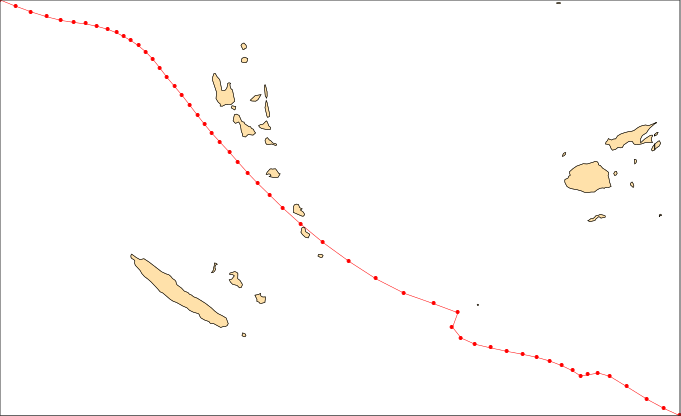

First steps
===========

Getting data
------------

There are two ways of loading data in *CliMetLab*, using :ref:`data
sources <data-sources>` or :ref:`datasets <datasets>`.

Data sources
^^^^^^^^^^^^

Data sources implement various methods to access and decode data.
When data are downloaded from a remote site, they are :ref:`cached
<caching>` on the local computer.

*CliMetLab* will infer the type of data by probing the downloaded
file. If the file contains gridded data, such as meteorological
fields, they will be accessible as an Xarray dataset, using the
``to_xarray()`` method.  If the file contains point data, such as
observation, they will be accessible as an as Pandas frame, using
the ``to_pandas()`` method. Other data may only be available as
NumPy arrays using the ``to_numpy()`` method.

The following example downloads a ``.csv`` file from NOAA's
*International Best Track Archive for Climate Stewardship* (IBTrACS_)
using the ``url`` data source. The file is downloaded into the local
cache. It is then converted as a Pandas frame. The rows corresponding
to the severe tropical cyclone Uma_ are extracted and plotted (more
on plotting below).

.. code-block:: python

    import climetlab as cml

    data = cml.load_source("url",
                          "https://www.ncei.noaa.gov/data/international-best-track-archive-for-climate-stewardship-ibtracs/v04r00/access/csv/ibtracs.SP.list.v04r00.csv")

    pd = data.to_pandas()
    uma = pd[pd.NAME == "UMA:VELI"]
    cml.plot_map(uma, style="cyclone-track")

.. list-table::
   :header-rows: 1
   :widths: 10 20 80

   * - Name
     - Parameter
     - Description

   * - ``"file"``
     - A path to a local file name.
     - TODO. :ref:`Read more <data-sources-file>`. (`Notebook <nb-file>`_).

   * - ``"url"``
     - A URL to a remote file.
     - TODO. :ref:`Read more <data-sources-url>`. (`Notebook <nb-url>`_).

   * - ``"cds"``
     - A request to the CDS API.
     - A request to retrieve data from the `Copernicus Climate Data Store`_ (CDS). Requires an account. :ref:`Read more <data-sources-cds>`. (`Notebook <nb-cds>`_).

   * - ``"mars"``
     - TODO
     - A request to retrieve data from ECMWF's meteorological archive (MARS), using the `ECMWF web API`_. Requires an account. :ref:`Read more <data-sources-mars>`. (`Notebook <nb-mars>`_).

Datasets
^^^^^^^^

.. code-block:: python

  import climetlab as cml

Simple plotting
---------------
*CliMetLab* will try to select the best way to plot data.

.. code-block:: python

    cml.plot_map(data)

Below are the parameters you can pass to the plot function:

.. list-table::
   :header-rows: 1
   :widths: 10 20 10 60

   * - Name
     - Value
     - Default
     - Description

   * - title
     - str or bool
     - ``False``
     - The title of the plot. Use ``True`` for automatic.

   * - projection
     - str
     - ``None``
     - The name of a map projection. Use ``None`` for automatic. See below for possible values.

   * - style
     - str
     - ``None``
     - The name of a plotting to apply. Use ``None`` for default. See below for possible values.

   * - foreground
     - str
     - ``None``
     - TODO. See below for possible values.

   * - background
     - str
     - ``None``
     - TODO. See below for possible values.

   * - path
     - str
     - ``None``
     - Save the plot in a file instead of displaying it.
       The file type is inferred from the path extension (``.png``, ``.pdf``, ``.svg``, ...)

You can find out what are the possible values for *projection*,
*style*, *foreground* and *background* parameters using the code below:

.. code-block:: python

  import climetlab.plotting

  # List of possible projections
  for p in climetlab.plotting.projections():
      print(p)

  # List of possible styles
  for p in climetlab.plotting.styles():
      print(p)

  # List of possible backgrounds/foregrounds
  for p in climetlab.plotting.layers():
      print(p)

To get more information about a given projection, in a Jupyter Notebook:

.. code-block:: python

  from climetlab.plotting import projection

  projection("global")

will output:

.. list-table::
  :header-rows: 0
  :widths: 10 90

  * - Name:
    - global
  * - Collection:
    - projections
  * - Path:
    - /opt/venv/lib/python3.7/site-packages/climetlab/data/projections/global.yaml
  * - Definition:
    - .. code-block:: yaml

        magics:
          mmap:
            subpage_lower_left_latitude: -90.0
            subpage_lower_left_longitude: -180.0
            subpage_map_projection: cylindrical
            subpage_upper_right_latitude: 90.0
            subpage_upper_right_longitude: 180.0

Advanced plotting
-----------------

There are two options to plot several datasets on the same map. If
you do not need to specify data specific parameters (e.g. *style*),
you can call ``cml.plot_map()`` with a list of data objects.

.. code-block:: python

  cml.plot_map((data1, data2), foreground=False)

or, if you want to specify a per-data custom *style*, you can use
``cml.new_map()``:

.. code-block:: python

  p = cml.new_plot(projection="global")
  p.plot_map(data1, style="style1")
  p.plot_map(data2, style="style2")
  p.show()

.. External URLs

.. _Copernicus Climate Data Store: https://cds.climate.copernicus.eu/#!/home
.. _IBTrACS: https://www.ncdc.noaa.gov/ibtracs/
.. _ECMWF web API: https://www.ecmwf.int/en/forecasts/access-forecasts/ecmwf-web-api
.. _Uma: https://en.wikipedia.org/wiki/1986–87_South_Pacific_cyclone_season#Severe_Tropical_Cyclone_Uma

.. Notebooks

.. _nb-file: examples/01-source-file.ipynb
.. _nb-url: examples/02-source-url.ipynb
.. _nb-cds: examples/03-source-cds.ipynb
.. _nb-mars: examples/04-source-mars.ipynb
