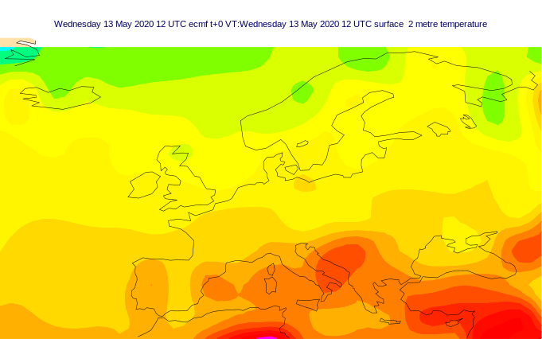
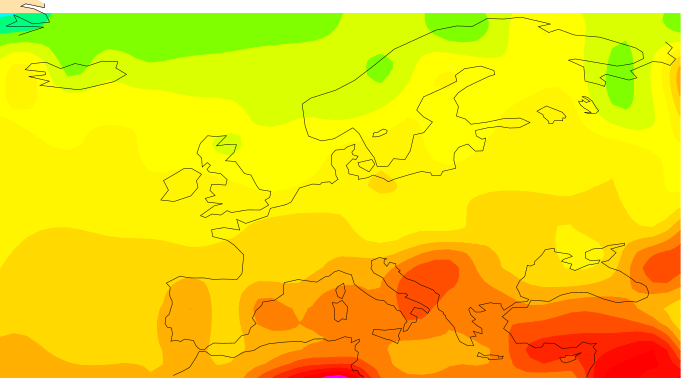
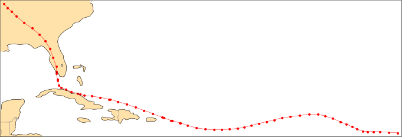

First Steps Tutorial
====================

This is an easy to follow tutorial that gets you up to speed with *CliMetLab*
to access scientific climate data.
It assumes you have basic Python programming knowledge.

So, let's start with what *CliMetLab* does best:

Getting data
------------

*CliMetLab* provides two main ways to access climate and meteorological data

1. Data Sources (:doc:`details <guide/sources>`)
2. Datasets (:doc:`details <guide/datasets>`)

Data Sources
^^^^^^^^^^^^

In *CliMetLab*, a *Data Source* refers to a local or remote storage server
or data archive from where we can download or access files related to climate
data.

To get started, let us first import *CliMetLab* at the top of our Python
notebook:

.. code-block:: python

    import climetlab as cml

Now download
`test.grib <https://raw.githubusercontent.com/ecmwf/climetlab/main/docs/examples/test.grib>`_ (example GRIB file)
to your project directory, or if you have ``wget`` command available, run
following in your notebook:

.. code-block::

    !wget https://raw.githubusercontent.com/ecmwf/climetlab/main/docs/examples/test.grib

GRIB is a file format for storage and sharing of gridded meteorological data.
You can think of gridded data as weather or some other data that is associated with
specific locations using coordinates. For example, wind speed data for
every longitude and latitude on a two dimensional grid.

The GRIB format (version 1 and 2) is `endorsed by WMO <https://en.wikipedia.org/wiki/GRIB>`_.
GRIB (GRIdded Binary) is a binary file format so you cannot look at it using a text editor.
But you sure can use *CliMetLab* to explore it:

.. code-block:: python

    grib_data = cml.load_source("file", "test.grib")

Here we used ``load_source`` method from *CliMetLab* to load our GRIB file
into ``grib_data`` variable. The first argument ``"file"`` specifies the type of
our data source. Which currently is indeed a local file that we downloaded.
The second argument is the path to that file.

Let's plot this data using the ``plot_map`` convenience method:

.. code-block:: python

    cml.plot_map(grib_data, title=True, path="test-grib-plot.svg")

The ``title`` and ``path`` arguments supplied to ``plot_map`` are optional.
When ``title`` is set to ``True``, the plot will include the title of the data
from our data file. If you specify the
``path`` ending with a supported format (``.svg``, ``.png``, ``.pdf``), the
plot will be saved at the specified location.

You can also use ``load_source`` to directly download and load files from remote
server, in one step. For example, let's download and plot a NetCDF file:

.. code-block:: python

    netcdf_url = "https://raw.githubusercontent.com/ecmwf/climetlab/main/docs/examples/test.nc"
    netcdf_data = cml.load_source("url", netcdf_url)
    cml.plot_map(netcdf_data)

If you don't know already, NetCDF_ is another commonly used data format for
transporting scientific data.

So, we have downloaded and plotted scientific weather data, can we convert
this data to work with our favorite Data Science library? ``Pandas``,
``Xarray`` or ``Numpy``?
Don't worry, *CliMetLab* has got you covered.

If your data is gridded data, like in our examples above,
you can simply call ``to_xarray()`` method to convert it to an ``Xarray``
object:

.. code-block:: python

    grib_xr = grib_data.to_xarray()
    # as well as:
    netcdf_xr = netcdf_data.to_xarray()

*CliMetLab* will infer the type of data by probing the downloaded
file. If the file contains gridded data, such as meteorological
fields, they will be accessible as an Xarray dataset, using the
``to_xarray()`` method.  If the file contains point data, such as
observations, they can be converted to a Pandas data frame via
the ``to_pandas()`` method. Other data may only be available as
NumPy arrays using the ``to_numpy()`` method.

Observations are usually data points corresponding to time for a
certain location unlike gridded data that contains data points
that is usually for a range of locations.
For example, monthly average temperature of Lahore for the past ten years.

The following example downloads a ``.csv`` file from NOAA's
*International Best Track Archive for Climate Stewardship* (IBTrACS_)
using the ``url`` data source. The file is downloaded into the local
cache. We then convert it to a Pandas frame. The rows corresponding
to the severe tropical cyclone Uma_ are extracted and plotted.

.. _data source example:

.. literalinclude:: datasource-example.py

.. image:: _static/datasource-example.svg
  :width: 100%

The Data Sources implement various methods to access and decode data.
When data are downloaded from a remote site, they are :ref:`cached
<caching>` on the local computer.

The first argument to ``load_source`` can take the following values:

.. list-table::
   :header-rows: 1
   :widths: 20 80

   * - Argument value
     - Description

   * - ``"file"``
     - A path to a local file name. :ref:`Read more <data-sources-file>`

   * - ``"url"``
     - A URL to a remote file. :ref:`Read more <data-sources-url>`

   * - ``"cds"``
     - A request to retrieve data from the `Copernicus Climate Data Store`_ (CDS). Requires an account. :ref:`Read more <data-sources-cds>`

   * - ``"mars"``
     - A request to retrieve data from ECMWF's meteorological archive (MARS), using the `ECMWF web API`_. Requires an account. :ref:`Read more <data-sources-mars>`

To read more about Data Sources, head over to :ref:`Data Sources guide <data-sources>`.

Now let's dive into the second way that you can access climate scientific data
using *CliMetLab*:

Datasets
^^^^^^^^

Datasets are a higher-level concept compared to data sources.

.. todo::

  metadata, hidden access to sources, control plotting, control conversion to pandas

The following Python code:

.. literalinclude:: dataset-example.py
  :lines: 1-4

will print:

.. code-block:: bash

  https://www.aoml.noaa.gov/hrd/hurdat/Data_Storm.html

then,

.. literalinclude:: dataset-example.py
  :lines: 6-7

will plot:

Compare that with the `data source example`_.

.. todo:

  Show differences.

Simple plotting
---------------
*CliMetLab* will try to select the best way to plot data.

.. code-block:: python

    cml.plot_map(data)

Below are the parameters you can pass to the plot function:

.. list-table::
   :header-rows: 1
   :widths: 10 20 10 60

   * - Name
     - Value
     - Default
     - Description

   * - title
     - str or bool
     - ``False``
     - The title of the plot. Use ``True`` for automatic.

   * - projection
     - str
     - ``None``
     - The name of a map projection. Use ``None`` for automatic. See below for possible values.

   * - style
     - str
     - ``None``
     - The name of a plotting to apply. Use ``None`` for default. See below for possible values.

   * - foreground
     - str
     - ``None``
     - TODO. See below for possible values.

   * - background
     - str
     - ``None``
     - TODO. See below for possible values.

   * - path
     - str
     - ``None``
     - Save the plot in a file instead of displaying it.
       The file type is inferred from the path extension (``.png``, ``.pdf``, ``.svg``, ...)

You can find out what are the possible values for *projection*,
*style*, *foreground* and *background* parameters using the code below:

.. literalinclude:: print-magics-objects.py

To get more information about a given projection, in a Jupyter Notebook:

.. code-block:: python

  from climetlab.plotting import projection

  projection("global")

will output:

.. list-table::
  :header-rows: 0
  :widths: 10 90

  * - Name:
    - global
  * - Collection:
    - projections
  * - Path:
    - /opt/venv/lib/python3.7/site-packages/climetlab/data/projections/global.yaml
  * - Definition:
    - .. code-block:: yaml

        magics:
          mmap:
            subpage_lower_left_latitude: -90.0
            subpage_lower_left_longitude: -180.0
            subpage_map_projection: cylindrical
            subpage_upper_right_latitude: 90.0
            subpage_upper_right_longitude: 180.0

Advanced plotting
-----------------

.. todo::

  Improve documentation.

There are two options to plot several datasets on the same map. If
you do not need to specify data specific parameters (e.g. *style*),
you can call ``cml.plot_map()`` with a list of data objects.

.. code-block:: python

    cml.plot_map((data1, data2), foreground=False)

or, if you want to specify a per-data custom *style*, you can use
``cml.new_map()``:

.. code-block:: python

  p = cml.new_plot(projection="global")
  p.plot_map(data1, style="style1")
  p.plot_map(data2, style="style2")
  p.show()

.. External URLs

.. _Copernicus Climate Data Store: https://cds.climate.copernicus.eu/
.. _IBTrACS: https://www.ncdc.noaa.gov/ibtracs/
.. _ECMWF web API: https://www.ecmwf.int/en/forecasts/access-forecasts/ecmwf-web-api
.. _Uma: https://en.wikipedia.org/wiki/1986–87_South_Pacific_cyclone_season#Severe_Tropical_Cyclone_Uma
.. _NetCDF: https://www.unidata.ucar.edu/software/netcdf/docs/

.. Notebooks

.. _nb-file: examples/01-source-file.ipynb
.. _nb-url: examples/02-source-url.ipynb
.. _nb-cds: examples/03-source-cds.ipynb
.. _nb-mars: examples/04-source-mars.ipynb
