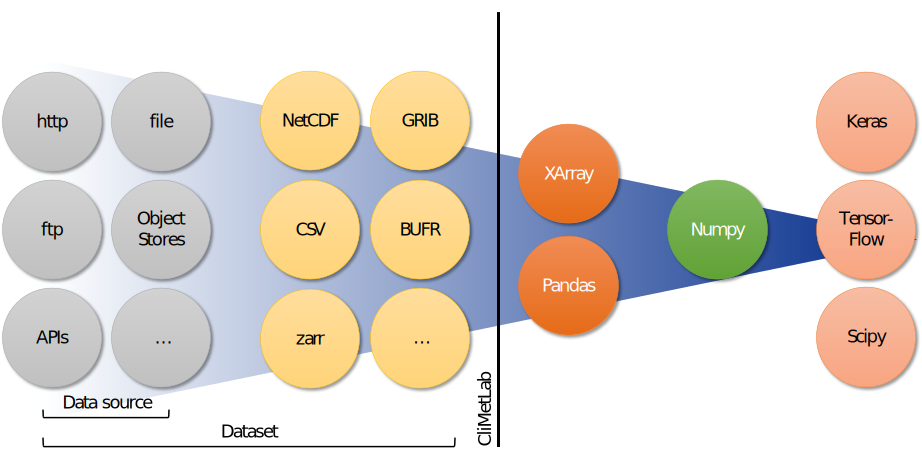
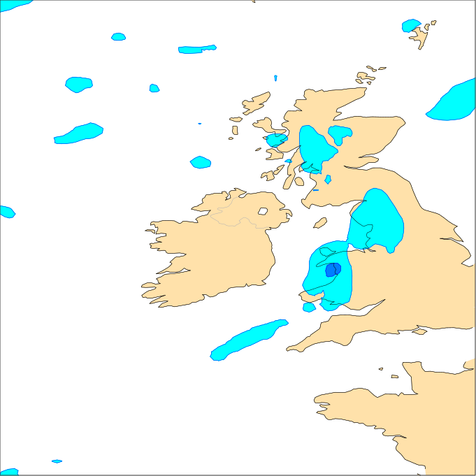

.. _overview:

Overview
========

*CliMetLab* is a Python package which is intended to be used in
Jupyter_ notebooks.  Its main goal is to greatly reduce boilerplate
code by providing high-level unified access to meteorological and
climate datasets, allowing scientists to focus on their research
instead of solving technical issues. Datasets are automatically
downloaded, cached and transform into standard  Python data structures
such as NumPy_, Pandas_ or Xarray_, that can then be fed into
scientific packages like SciPy_ and TensorFlow_. *CliMetLab* also
aims at simplifying plotting of 2D maps, by automatically selecting
the most appropriate styles and projections for any given data.

The goal of *CliMetLab* is to simplify access to climate and
meteorological datasets, by hiding the access methods and data
formats. The snippet of code below would download the dataset *dataset-name*,
cache it locally and decodes its content as a NumPy array:

.. code-block:: python

    import climetlab as clm

    data = clm.load_dataset("dataset-name")
    a = data.to_numpy()

To achieve this, *CliMetLab* introduces two concepts: :ref:`Data
source <data-sources>` and :ref:`Dataset <datasets>`. Data sources
represent various access methods, such as reading files, downloading
from a web site or using APIs.

*CliMetLab* provides the interface between the left side and the
right side of the figure below:

*CliMetLab* also provides very high-level map plotting facilities.
By default *CliMetLab* will automatically select the most appropriate
way to plot a dataset, choosing the best projection, colours and
other graphical attributes. Users can then control how maps are
drawn by overriding the automatic choices with their own.

.. code-block:: python

    import climetlab as clm

    data = clm.load_dataset("some-dataset")
    cml.plot_map(data)

.. _Jupyter: https://jupyter.org
.. _NumPy: https://numpy.org
.. _Matplotlib: https://matplotlib.org
.. _Pandas: https://pandas.pydata.org
.. _Xarray: http://xarray.pydata.org
.. _SciPy: https://www.scipy.org
.. _TensorFlow: https://www.tensorflow.org
.. _Keras: https://keras.io
.. _PyTorch: https://pytorch.org
