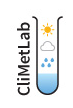

.. CliMetLab documentation master file, created by
   sphinx-quickstart on Tue Jul 21 11:34:48 2020.
   You can adapt this file completely to your liking, but it should at least
   contain the root `toctree` directive.

Welcome to CliMetLab's documentation!
=====================================

CliMetLab is a Python package aiming a simplyfying access to climate and meteorological datasets, allowing users to focus on science instead of
technical issues such as data access and data formats. It is mostly intended to be used in Jupyter_ notebooks, and be interoperable with all popular
data analystic packages, such as Numpy_, Pandas_, Xarray_, SciPy_, Matplotlib_, etc. and well as machine learning frameworks, such as Tensorflow_, Keras_ or PyTorch_.

>>> import climetlab as cml
>>> #
>>> s = cml.load_source('file', 'data.grib')
12

.. toctree::
   :maxdepth: 2
   :caption: Contents:

Indices and tables
==================

* :ref:`genindex`
* :ref:`modindex`
* :ref:`search`

.. _Jupyter: https://jupyter.org
.. _Numpy: https://numpy.org
.. _Matplotlib: https://matplotlib.org
.. _Pandas: https://pandas.pydata.org
.. _Xarray: http://xarray.pydata.org
.. _SciPy: https://www.scipy.org
.. _Tensorflow: https://www.tensorflow.org
.. _Keras: https://keras.io
.. _PyTorch: https://pytorch.org
